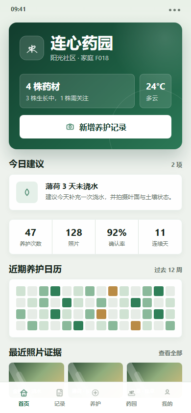
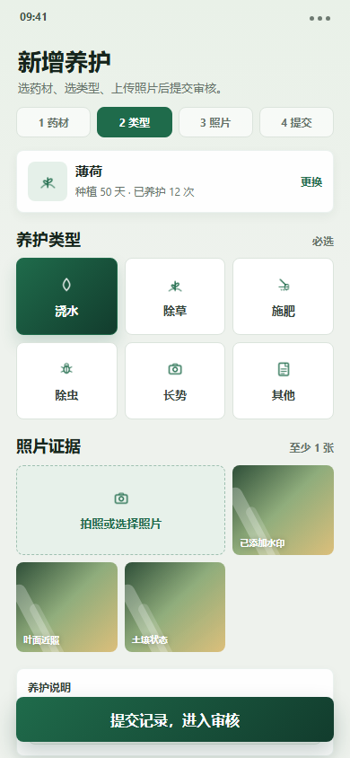
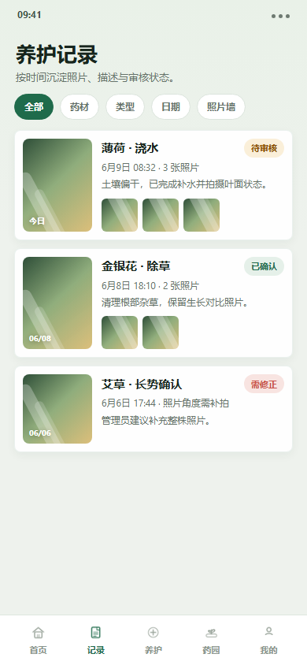
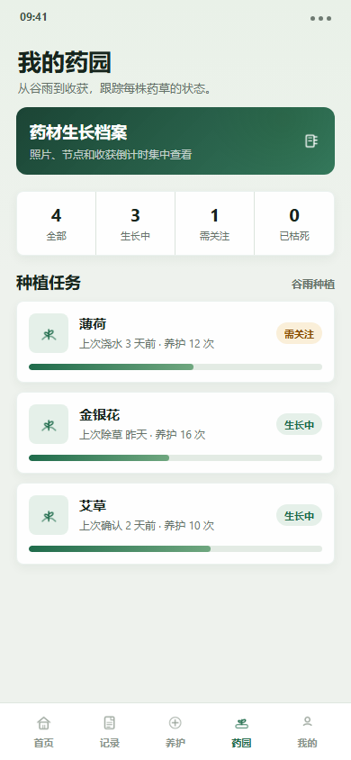
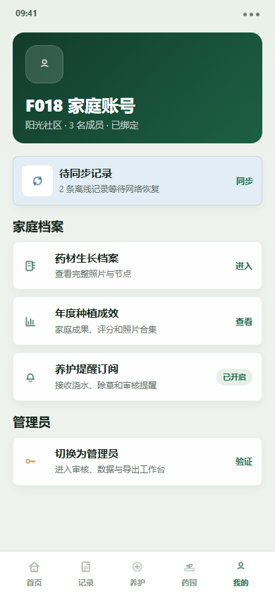
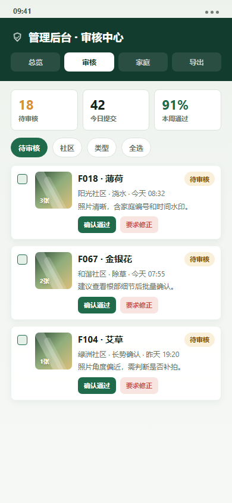

# Lianxin Medicine Garden

[English](README.md) | [简体中文](README.zh-CN.md)


Lianxin Medicine Garden is an open source WeChat Mini Program for community herb-growing activities. It helps families record daily plant care with photo evidence and helps administrators review records, track participation, and export summary data.

The project was designed for a community-scale activity with about 200 families across multiple neighborhoods, but the codebase can be reused for schools, community groups, public welfare programs, and other long-running activity record systems.

## Project Status

This repository is the first open source release of a complete Mini Program implementation. It is intended as a reusable template for community activity operations, labor education programs, school-family collaboration, and public welfare projects.

The original deployment scenario covers:

- About 200 participating families
- 5-8 community neighborhoods
- Long-running daily care records from planting season through year-end
- Family submissions, administrator review, participation scoring, and annual reporting

## Screenshots

| Home | Submit | Records |
| --- | --- | --- |
|  |  |  |

| Garden | Profile | Admin |
| --- | --- | --- |
|  |  |  |

## Features

- Family binding by family code and phone verification
- Daily herb care submissions with required photo evidence
- Offline-first submission queue with automatic retry
- Care record timeline and photo wall
- Herb task cards and growth archives
- Administrator dashboard, audit workflow, family management, and data export
- Annual showcase, scoring, badges, charts, and reminders
- WeChat Cloud Development backend with cloud functions and cloud database collections

## Why This Project Matters

Many community and school programs still rely on chat groups, spreadsheets, and manual photo collection. This project turns that workflow into a reusable open source system with clear roles, auditable submissions, offline support, and exportable records.

The codebase is useful for developers building similar WeChat Mini Program workflows that need:

- Family or participant binding
- Photo-backed activity records
- Administrator review and correction loops
- Offline-first mobile submission
- Community-level statistics and reports

## Tech Stack

- WeChat Mini Program native framework: WXML, WXSS, JavaScript
- WeChat Cloud Development: cloud functions, cloud database, cloud storage
- Target base library: 3.6.0+

## Repository Layout

```text
miniprogram/        Mini Program frontend pages, components, utilities, and assets
cloudfunctions/     WeChat Cloud Functions
docs/               Requirements, database schema, and design notes
scripts/            Database initialization helpers
```

## Getting Started

1. Import this repository in WeChat Developer Tools.
2. Replace `appid` in `project.config.json` with your own Mini Program AppID.
3. Replace `your-cloud-env-id` in `miniprogram/app.js` with your own WeChat Cloud environment ID.
4. Create the cloud database collections described in `docs/database-schema.md`.
5. Deploy the cloud functions under `cloudfunctions/`.
6. Run the database initialization function once and pass a strong `adminPassword` value.

For evaluation without real participant data, generate a synthetic dataset:

```bash
node scripts/generate-demo-data.js
```

## Roadmap

- Harden administrator authentication and cloud database permission rules
- Add a deployment checklist for new community operators
- Improve sample data and demo mode for evaluation without real family data
- Add automated smoke tests for cloud functions
- Add bilingual documentation for broader reuse
- Improve export templates for semester and annual review reports
- Keep community-operator documentation aligned with deployment changes

## Maintainer Responsibilities

The maintainer currently handles:

- Feature planning and issue triage
- Mini Program frontend maintenance
- WeChat Cloud Function maintenance
- Database schema and seed data updates
- Documentation, release notes, and deployment guidance
- Security review for administrator flows, uploads, and exports

## Security Notes

- Do not commit `project.private.config.json`.
- Do not commit real cloud secrets, API keys, or administrator passwords.
- The seed script requires the administrator password to be provided during deployment or invocation.
- Review cloud database permissions before production use.
- Report security concerns privately when possible; see `SECURITY.md`.

## Contributing

Contributions are welcome for documentation, deployment scripts, security hardening, issue reproduction, and Mini Program compatibility fixes. See `CONTRIBUTING.md`.

## Documentation

- Requirements: `docs/requirements.md`
- Database schema: `docs/database-schema.md`
- Deployment checklist: `docs/deployment-checklist.md`
- Demo mode: `docs/demo-mode.md`
- Deployment notes: `docs/points-bank-deployment.md`
- Community operator guide: `docs/community-operator-guide.md`
- Discovery and positioning notes: `docs/discovery-and-positioning.md`

## License

This project is licensed under the MIT License.
